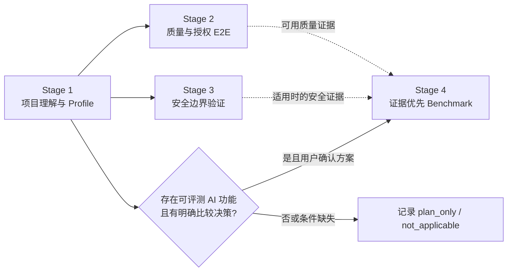

# Project Verifier

> 面向 AI Coding Agent 的项目理解与证据验证 Skill：帮助你回答“项目是什么、已经证明什么、尚未证明什么”。

`$project-verifier` 先建立来源可追溯的项目理解，再按适用性推进质量、安全边界和 AI Benchmark。它不是自动保证项目质量或安全的平台；所有结论只在对应源码版本、授权范围和实际证据内成立。

## 为什么需要它

AI Coding 能快速生成代码和测试，但项目交接、验证和面试讲解常在以下位置断裂：

- **看不懂项目**：入口、模块关系、数据流和 P0 用户路径散落在代码、配置与脚本中。
- **验证不成链**：测试、E2E、扫描和 Benchmark 各自运行，却没有统一的范围、日志、失败原因和证据来源。
- **AI Benchmark 容易偏题**：没有明确业务主张、Baseline、样本或预算时就开始测分，最后只得到难以解释的结果。
- **成果难以防守**：README 或面试材料写得很好，却无法追溯到当前代码版本、真实测试输出和已知限制。

它适合接手陌生仓库的开发者、需要验证 AI Coding 产出的使用者、学习项目理解与验证方法的 AI 产品学习者，以及希望把项目经历讲清楚的求职者。它是一个本地工作流 Skill，不包装成 SaaS 或替代工程判断。

## 使用模式与停止条件

| 模式 | Agent 会做什么 | 什么时候停止或降级 |
| --- | --- | --- |
| **推荐默认** | 先运行 Stage 1，只读理解项目，产出理解材料并请用户确认目标、P0 路径和事实纠正 | Profile 未确认或源码已变化时，不进入后续阶段 |
| **选择性阶段** | 用户指定 Stage 2、3 或 4 时，先检查当前 Profile | 缺少前置 Profile 时只做只读补采集；不伪造前置产物 |
| **`plan_only / not_applicable`** | 记录建议、条件、限制和恢复方式 | 缺少凭据、批准数据、适用 AI 功能或明确比较主张时，不执行真实调用 |
| **可选导出** | 生成 README 优化副本或面试/答辩/作品集证据包 | 仅在用户明确请求后触发；不属于默认四阶段 |

未回复不等于批准。真实调用、依赖安装、生产代码修改、敏感数据、成本和公开主张都必须由用户确认。

## 场景化快速开始

以下示例均可直接作为对 Agent 的请求。它们不会要求自动跑完全部阶段。

### 只理解项目

```text
使用 $project-verifier 只执行 Stage 1。先只读理解当前项目，生成项目报告、流程矩阵和 Profile；请在确认 P0 路径前不要进入后续阶段。
```

### 先做离线质量检查

```text
使用 $project-verifier 执行 Stage 2。优先复用已有 lint、构建、单元和集成测试，只做离线质量检查；如需真实 E2E，先输出计划并执行无调用 preflight，等我确认后再运行。
```

### 先规划安全边界验证

```text
使用 $project-verifier 执行 Stage 3。根据当前 Profile 推荐适配本项目的安全工具和检查范围，说明覆盖盲区；不要安装工具、不要扫描、不要联网，先等待我的选择。
```

### 先设计 AI Benchmark

```text
使用 $project-verifier 执行 Stage 4 的方案阶段。根据项目证据和我希望突出的方向，提出 3-5 个 Benchmark 候选方向；说明 Baseline、样本、指标、预计调用量和限制，但不要调用模型或 API。
```

### 导出面试证据包

```text
使用 $project-verifier 为当前项目准备可选面试证据包。先从当前 workbench 生成候选主张表，等我确认后才写 interview_evidence_pack.md。
```

## 设计差异

下表说明本项目选择的设计取舍，不是对其他项目的绝对排名。

| 常见做法 | Project Verifier 的设计 | 可复核价值 |
| --- | --- | --- |
| 一次性生成项目总结 | 将入口、路径、图表和 Profile 绑定来源证据 | 图表和结论能回到源码核查；未知项不会被填空式脑补 |
| 将测试通过率等同项目质量 | 分开记录结果状态与执行范围 | 未执行、失败、部分完成和证据不足不会被包装成成功 |
| 先跑 Benchmark，再解释结果 | 以“前序证据 + 用户希望突出方向”作为双输入 | Benchmark 服务于项目特点与用户决策，而不是默认模型对比 |
| 直接生成面试话术 | 先确认候选主张，再从当前 revision 的证据生成叙事 | 项目讲解能同时说明贡献、结果和限制 |

核心不是“做更多检查”，而是把项目理解、授权、执行、证据和公开主张连接起来，同时把用户确认控制在少而关键的节点。

## 四阶段工作流



| 阶段 | Agent 负责 | 用户关键决定 | 主要产物 | 什么时候不继续执行 |
| --- | --- | --- | --- | --- |
| **Stage 1 项目理解** | 只读遍历、入口与模块梳理、架构/模块/用户流程图、Profile | 目标、P0 路径、事实纠正 | `project_report.md`、`flow_matrix.md`、`project_profile.json` | 范围不清或证据不足时记录 unknown，不确认 Profile |
| **Stage 2 质量与授权 E2E** | 离线质量检查、可运行性、授权的 Smoke/Live E2E | 选定路径；真实调用与成本 | `quality_report.md`、`stage2_quality_results.json`、日志 | 没有选定路径或实时授权时，只保留离线结果或计划 |
| **Stage 3 安全边界** | 工具建议、预检、受控发现归一化 | 工具、能力、范围与副作用 | `security_report.md`、`stage3_security_results.json` | 工具不适配、用户拒绝或范围不安全时，记录 fallback 或计划，不安装、不扫描 |
| **Stage 4 条件式 AI Benchmark** | 从证据和用户方向形成比较方案 | 方向、最终方案、Baseline、指标与预算 | `stage4_benchmark_plan.md`；适用时生成结果、报告与收据 | 非 AI、无明确主张、凭据/数据/Baseline 不足时标记 `not_applicable` 或 `plan_only` |

Stage 1 是共同前置。Stage 2、Stage 3 和 Stage 4 都只消费当前有效的 Profile；Stage 2/3 的证据会在相关时输入 Stage 4，但不是 Benchmark 的机械必经前置。

## Agent 与用户如何分工

| Agent 自主处理 | 必须由用户决定 |
| --- | --- |
| 只读分析、图表草稿、已有脚本复用、低风险可逆细节、失败与未知的记录 | 目标、P0 路径、真实调用、成本、安装、生产改动、敏感数据、Baseline、指标、公开主张、面试包 |

Agent 不应把用户拖入文件名、命令拼接或实现胶水等细节；只有会改变产品目标、成本、风险、结果解释或公开表达的事项才需要确认。

## 产物与证据层

```text
project_verification_workbench/
├── project_report.md
├── flow_matrix.md
├── project_profile.json
├── verification_manifest.json
├── authorizations/
├── quality_report.md                 # Stage 2 适用时
├── stage2_quality_results.json       # Stage 2 适用时
├── security_report.md                # Stage 3 适用时
├── stage3_security_results.json      # Stage 3 适用时
├── stage4_benchmark_plan.md          # Stage 4 适用时
├── stage4_benchmark_results.json     # Stage 4 适用时
└── benchmark_report.md               # Stage 4 适用时
```

| 层级 | 典型内容 | 用途 |
| --- | --- | --- |
| **人读材料** | `project_report.md`、`flow_matrix.md`、质量/安全/Benchmark 报告 | 理解项目、复查结论和沟通限制 |
| **机器证据** | manifest、`authorizations/`、阶段结果 JSON、日志与 receipt | 绑定当前源码、授权、执行范围和原始结果 |
| **条件产物** | Stage 4 计划/结果、README 优化副本、面试证据包 | 只在适用或用户明确请求时生成 |

不是每次运行都会生成全部文件。`verification_manifest.json` 和授权收据提供本地可追溯关联，不是对本地文件的密码学防篡改保证。

## 可选面试、答辩与作品集证据包

仅当用户明确提出需要面试、答辩或作品集讲解时才启用。它不创建新的原始证据，也不会预先生成简历话术。

导出前，Agent 必须从当前 revision 的 workbench 和用户实际贡献生成候选主张表；每项包含证据路径、适用范围、限制和不应声称的更强结论。用户确认后才生成：

```text
project_verification_workbench/interview_evidence_source_map.md
interview_evidence_pack.md
```

证据包可以汇总项目叙事、产品/技术决策、已验证结果、限制、可能问题和可追溯回答。没有 Git 历史或其他带日期证据时，只能描述当前架构与未来选项，不能编造架构演进。

## 可信度、安全与不做什么

- **脚本优先**：优先复用项目已有测试、构建、lint 与 E2E；不自动安装工具。
- **预检无副作用**：`preflight` 不执行目标路径、模型、API、扫描或生产代码修改。
- **授权和源码变化会失效**：计划、源码 revision、授权 envelope 或执行上限不一致时拒绝执行；未回复不等于批准。
- **结果如实保留**：失败、负面结果、空输出、缺少遥测和 `inconclusive` 都是有效结果，不能转化为正向主张。
- **原始指标优先**：AI Benchmark 使用项目自定义指标、阈值、样本量和证据；不使用通用总分或默认雷达图。
- **LLM Judge 有边界**：不能单独证明安全、隐私或泄漏，需要其他可复核证据。
- **executor 不是 sandbox**：项目 executor 是显式授权的未隔离 bridge，不是操作系统级隔离。
- **不替代专业活动**：不替代渗透测试、合规认证、真实用户测试或工程判断；静态理解也不是完整代码审计或漏洞不存在证明。

## 仓库结构

```text
skills/project-verifier/
├── SKILL.md
├── workflows/
├── templates/
├── scripts/
├── references/
├── tests/
└── evals/
optional/codex-hook/
```

## 安装与调用

```text
repository: https://github.com/Conradgui/project-verifier-skill.git
skill path: skills/project-verifier
invocation: $project-verifier
```

```bash
python3 /Users/conrad/.codex/skills/.system/skill-installer/scripts/install-skill-from-github.py \
  --url https://github.com/Conradgui/project-verifier-skill/tree/main/skills/project-verifier
```

## 开发验证

```bash
PYTHONPYCACHEPREFIX=/tmp/project-verifier-pycache \
  python3 -m unittest discover -s skills/project-verifier/tests -p 'test_*.py' -v
python3 /Users/conrad/.codex/skills/.system/skill-creator/scripts/quick_validate.py skills/project-verifier
./bootstrap.sh codex --dry-run
```

这些命令验证的是本 Skill 的离线合同、runner 和模板；它们不证明任意目标项目的真实质量、安全性或用户体验。

`optional/codex-hook/` 提供独立的高风险动作提示与阻断辅助。它不随 Skill 自动安装、不替代授权 Gate，也不是 sandbox；安装与边界见 [Hook 说明](optional/codex-hook/README.md)。

## 范围说明

本仓库用于个人学习与本地使用。它的价值是让项目验证与项目讲解更可解释，而不是替代发布流程或专业判断。
