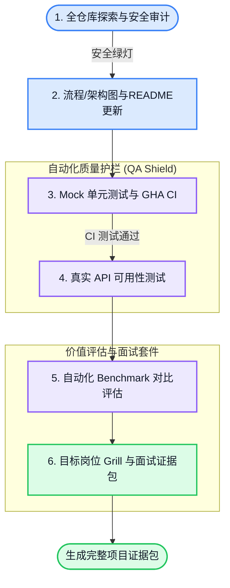

# 🤖 AI-Agent Project Verifier & Portfolio Builder

[](https://opensource.org/licenses/MIT)
[](http://makeapullrequest.com)
[](https://github.com/features/copilot)

> **将你的 AI 代理项目从“简易 Wrapper”提升为“企业级工程产品”，为你的求职面试与技术出海建立不可伪造的质量证据链。**

---

## 🌟 核心痛点：为什么你需要它？

在 AI-First 时代，构建一个基于大模型的 App 变得非常简单。但这给开发者带来了新的挑战：
1. **面试官的质疑**：“你这个项目是不是套壳？系统稳定性怎么保证？你真的懂架构设计吗？”
2. **非确定性系统的管理**：大模型（LLM）的输出是发散且不稳定的，传统的单元测试无法有效评估其边界、成本消耗与幻觉率。
3. **缺乏可量化的价值证据**：无法用数据直观证明“使用你的 Agent 系统”比“直接调用 OpenAI/Gemini 裸模型接口”到底强在哪里。

**AI-Agent Project Verifier** 就是你的**自动化 QA 架构师**与**技术面试顾问**。它通过**三层测试框架**与**定制化岗位 Grill 对齐机制**，自动为你的项目注入工业级测试护栏，并生成专属面试证据包。

---

## 🧭 6阶段项目质量与价值验证流



---

## 🛠️ 三层测试框架 (3-Tier Testing Architecture)

本套件严格遵循现代 AI 系统的分层测试最佳实践：

| 层级 | 测试类型 | 是否使用真实 API | 证明什么 (Proves What) |
| :---: | :--- | :---: | :--- |
| **L1** | **Mock 质量测试** | ❌ 使用 mock/VCR | **代码逻辑正确性与安全边界**。无 API 成本，极速运行，拦截 SQL 注入与路径穿越漏洞。 |
| **L2** | **真实可用性测试** | ✅ 使用真实 API | **端到端（E2E）主流程畅通**。使用真实网络验证模型 API 解析与文件写入行为。 |
| **L3** | **自动化 Benchmark 评测** | ✅ 使用真实 API | **系统的存在价值**。定量证明你的系统在“完整度、可审计性、安全性、Token效率”上显著优于裸模型。 |

---

## ⚡ 快速开始 (Quick Start)

### 方式 1：把仓库地址发给 Codex 安装（推荐）

在 Codex 中直接发送：

```text
请安装这个 Codex skill 仓库：
https://github.com/Conradgui/project-verifier-skill.git
```

Codex 应识别本仓库内的 skill 路径：

```text
skill path: skills/project-verifier
invoke name: $project-verifier
```

如果 Codex 需要手动安装命令，可以使用：

```bash
python3 /Users/conrad/.codex/skills/.system/skill-installer/scripts/install-skill-from-github.py \
  --url https://github.com/Conradgui/project-verifier-skill/tree/main/skills/project-verifier
```

安装后重启 Codex，让新 skill 被重新发现。

### 方式 2：本地软链接安装

如果你已经克隆本仓库，也可以运行根目录下的 `bootstrap.sh`，将 `skills/project-verifier` 软链接到本机 Agent CLI 的 skill 目录。建议先 dry run 查看计划：

```bash
chmod +x bootstrap.sh

./bootstrap.sh codex --dry-run
./bootstrap.sh codex

# 或链接至已检测到的多个 Agent CLI skill 目录
./bootstrap.sh all --dry-run
./bootstrap.sh all
```

### 方式 3：召唤 Agent 运行验证

部署完成后，在你的 AI 编程终端（如 **Codex** 或 **Claude Code**）中，对目标项目执行：

```text
# 一站式顺序运行 1-6 阶段
使用 $project-verifier 对当前项目运行 phase1-phase6 全流程验证与面试证据生成。

# 选择性运行某一阶段
使用 $project-verifier 对当前项目运行 phase1 只读探索和安全审计。
使用 $project-verifier 的 phase3 为当前项目生成 mock 测试和 GitHub Actions 配置。
```

---

## 📂 技能模块结构

```
.
├── AGENTS.md                  # Codex 仓库级安装识别说明
├── bootstrap.sh               # 本地软链接安装脚本
├── skills/
│     └── project-verifier/
│           ├── SKILL.md       # 技能总控（Main Orchestrator）
│           ├── agents/
│           │     └── openai.yaml # Codex UI 元数据与默认调用提示
│           ├── workflows/     # 每个验证阶段的独立 Workflow 配置文件
│           │     ├── phase1_explore.md  # 阶段 1：只读源码探索与安全审计
│           │     ├── phase2_diagrams.md # 阶段 2： Mermaid 图生成与 README 备份更新
│           │     ├── phase3_quality.md  # 阶段 3：VCR 录制、单元测试与 GitHub Actions
│           │     ├── phase4_usability.md# 阶段 4：真实 API 可用性测试
│           │     ├── phase5_benchmark.md# 阶段 5：LLM-as-a-Judge 与 HTML 看板评测
│           │     └── phase6_interview.md# 阶段 6：目标岗位 Grill 与面试证据包
│           └── templates/     # 评估器与测试运行器模板
│                 ├── benchmark_evaluator_template.py # Radar 图 HTML 生成器
│                 └── run_usability_template.sh       # 独立 E2E 测试脚本
├── CONTRIBUTING.md            # 开源贡献指南
├── LICENSE                    # MIT 开源许可证
└── README.md                  # 本文档
```

---

## 📊 成果展现：Benchmark 雷达图看板

在阶段 5 运行结束后，系统除了生成 Markdown 对比报告，还会在项目内自动输出静态可视化面板 `interview_evidence_pack/benchmark_radar.html`。双击即可在任何浏览器中打开：

 *(使用 Chart.js 渲染的动态雷达图效果展示)*

### 生成的面试官证据包 (`interview_evidence_pack/`)
在最后一阶段，Agent 会基于你的目标岗位招聘需求（JD）以及与你的 Grill 对齐内容，输出以下文档：
*   **`narrative_scripts.md`**：30秒、2分钟、5分钟的自我介绍与项目陈述话术。
*   **`product_decisions.md`**：系统架构的关键技术折衷选择（Trade-offs）与裁剪范围记录。
*   **`verification_evidence.md`**：可复现的自动化测试覆盖率数据与 Benchmark 量化优势指标。
*   **`architectural_evolution.md`**：项目演进路径、现有技术债与重构路线图。

---

## 🤝 参与贡献 (Contributing)

我们非常欢迎社区提交 Pull Request 或 Issue 来优化该技能模版！请在提交 PR 前查阅 [CONTRIBUTING.md](CONTRIBUTING.md) 以获取开发指南与规范。

---

## 📄 开源许可证

本项目基于 [MIT License](LICENSE) 许可开源。
