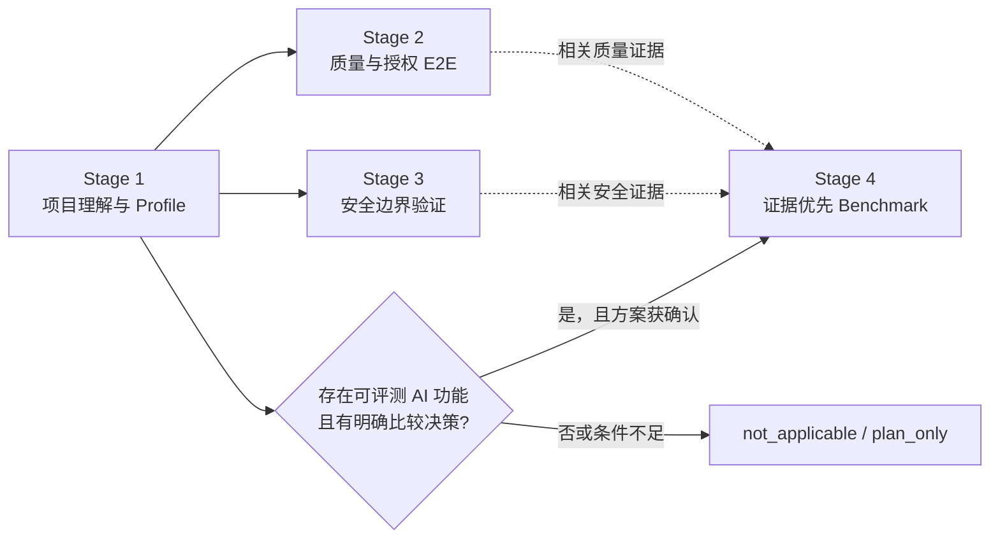

# Project Verifier

> 面向 AI Coding Agent 的证据优先项目理解与验证 Skill：先回答“项目是什么”，再区分“已经证明什么、尚未证明什么”。

`$project-verifier` 将项目理解、质量验证、安全边界和条件式 AI Benchmark 串成一条 revision 绑定的证据链。默认只执行只读的 Stage 1；安装、真实调用、扫描、成本、敏感数据和公开主张都保留独立 Gate。

它适合接手陌生仓库的开发者、需要验证 AI Coding 产出的使用者，以及学习项目理解、验证设计和 AI 产品判断的人。它是本地工作流 Skill，不是自动保证质量或安全的 SaaS 平台。

## 快速开始

### 从 GitHub 安装到 Codex

仓库根目录不是 Skill 目录；实际安装目标是 `skills/project-verifier`：

```bash
python3 "${CODEX_HOME:-$HOME/.codex}/skills/.system/skill-installer/scripts/install-skill-from-github.py" \
  --url https://github.com/Conradgui/project-verifier-skill/tree/main/skills/project-verifier
```

### 克隆后本地链接

`bootstrap.sh` 支持 `codex`、`claude`、`gemini`、`opencode` 和 `antigravity`。先预演目标与已有安装，再执行链接：

```bash
git clone https://github.com/Conradgui/project-verifier-skill.git
cd project-verifier-skill

./bootstrap.sh codex --dry-run
./bootstrap.sh codex
```

### 第一次运行：只理解项目

```text
使用 $project-verifier 只执行 Stage 1。先只读理解当前项目，生成项目报告、流程矩阵和 Profile；请在确认 P0 路径前不要进入后续阶段。
```

Stage 1 默认生成：

```text
project_verification_workbench/
├── project_report.md
├── flow_matrix.md
└── project_profile.json
```

确认 Profile 后，再决定是否需要质量、安全或 Benchmark 证据；不需要为了“完整”跑完所有阶段。

## 它解决什么问题

AI Coding 可以快速生成代码，但从“代码存在”到“结论可信”之间经常断在四个位置：

- **项目理解没有来源**：入口、模块、数据流和 P0 路径被总结出来，却无法回到当前源码核查。
- **测试结果没有边界**：通过率、E2E、扫描与 Benchmark 混在一起，未执行、失败和部分完成容易被写成成功。
- **高风险动作缺少授权面**：安装、真实 API、网络、扫描、成本与生产修改经常被一个模糊的“继续”打包批准。
- **公开叙事先于证据**：README、面试材料或优势主张写得很完整，但没有绑定 revision、执行范围、原始结果和已知限制。

Project Verifier 的重点不是“做更多检查”，而是把项目理解、用户决策、执行证据和可公开主张连接起来。

## 四阶段工作流



| 阶段 | Agent 负责 | 用户关键决定 | 主要产物 | 停止或降级条件 |
|---|---|---|---|---|
| **Stage 1 项目理解** | 只读遍历、入口与模块梳理、流程与 Profile 草稿 | 目标、P0 路径、事实纠正 | `project_report.md`、`flow_matrix.md`、`project_profile.json` | 范围或证据不足时保留 unknown，不确认 Profile |
| **Stage 2 质量与授权 E2E** | 复用离线测试、构建、lint；规划 Smoke/live 路径 | 选定路径、真实调用、成本与副作用 | `quality_report.md`、Stage 2 results/logs | 未选择路径或未授权 live envelope 时只保留离线证据/计划 |
| **Stage 3 安全边界** | 从 Profile 推导表面、比较工具、预检并归一化结果 | 工具、能力、网络、扫描范围与 bridge 信任 | `security_report.md`、Stage 3 results/raw evidence | 工具不适配、范围不安全或权限缺失时记录 fallback/plan-only |
| **Stage 4 AI Benchmark** | 从项目证据与用户方向形成比较方案 | 方向、Baseline、数据、指标、预算与最终方案 | plan、results、receipt、`benchmark_report.md` | 非 AI、无明确主张或缺少凭据/数据/Baseline 时标记 `not_applicable`/`plan_only` |

Stage 1 是共同前置。Stage 2、3、4 只消费当前有效且已确认的 Profile；源码 revision 或确认字段发生变化时，依赖证据会失效并返回相应 Gate。

## 常用请求

### 离线质量检查优先

```text
使用 $project-verifier 执行 Stage 2。优先复用已有 lint、构建、单元和集成测试；如需真实 E2E，先输出计划和无调用 preflight，等我确认后再运行。
```

### 先规划安全验证

```text
使用 $project-verifier 执行 Stage 3。根据当前 Profile 推荐适合本项目的工具和范围，说明覆盖盲区；不要安装、扫描或联网，先等待我的选择。
```

### 先设计 AI Benchmark

```text
使用 $project-verifier 执行 Stage 4 的方案阶段。根据项目证据和我希望突出的方向，提出 3–5 个候选；说明 Baseline、样本、指标、预计调用量和限制，但不要调用模型或 API。
```

## 证据与授权模型

### 四个状态维度分开记录

| 维度 | 回答的问题 | 示例 |
|---|---|---|
| `phase_status` | 流程走到哪里 | `pending` / `completed` / `blocked` |
| `result_outcome` | 证据结果是什么 | `passed` / `partial` / `failed` / `inconclusive` |
| `execution_scope` | 实际执行了多少 | `none` / `plan_only` / `pilot` / `full` |
| `claim_eligibility` | 证据能支持多强的主张 | `none` / `pilot` / `full` |

因此，“阶段完成”不等于“结果通过”，“pilot 成功”也不等于完整优势主张。

### Agent 与用户分工

| Agent 自主处理 | 必须由用户决定 |
|---|---|
| 只读分析、图表草稿、已有脚本复用、低风险可逆细节、失败与未知记录 | 目标、P0 路径、安装、生产修改、真实调用、成本、敏感数据、Baseline、指标与公开主张 |

用户只处理会改变目标、风险、成本或结果解释的决策；文件名、命令拼接和实现胶水由 Agent 负责。未回复不等于批准。

### Workbench

```text
project_verification_workbench/
├── verification_manifest.json
├── project_report.md
├── flow_matrix.md
├── project_profile.json
├── authorizations/
├── quality_report.md
├── stage2_quality_results.json
├── security_report.md
├── stage3_security_results.json
├── stage4_benchmark_plan.md
├── stage4_benchmark_results.json
└── benchmark_report.md
```

文件按阶段和适用性生成，不是每次运行都会出现。Manifest、decision envelope 与 receipt 将计划、源码、授权范围和结果关联起来；它们提供本地可追溯性，不是对可写本地文件的密码学防篡改。

## 关键设计判断与 trade-off

| 设计判断 | 解决的痛点 | 取舍 |
|---|---|---|
| **Stage 1 作为共同前置，而不是默认跑完整套件** | 避免还没理解项目就开始测试、扫描或 Benchmark | 多一个 Profile 确认点，但换来后续阶段共享同一事实基础 |
| **分开进度、结果、范围与主张资格** | 避免“流程完成 = 项目质量通过”的错误叙事 | 状态模型更复杂，但失败、部分完成和未执行不会被压成一个分数 |
| **高风险能力分别授权** | 避免一次“继续”同时批准安装、网络、扫描、成本和生产修改 | 用户会在实质变化时暂停决策，但授权范围更可复核 |
| **Benchmark 使用“项目证据 + 用户希望突出方向”双输入** | 避免先跑通用模型对比，再倒推一个项目故事 | 前期必须明确比较决策、Baseline 和指标，但结果更能服务真实判断 |
| **安全工具采用项目适配 adapter，而不是内置万能扫描器** | 不同技术栈、目标和风险表面无法用同一工具覆盖 | 需要比较可用后端与盲区；换来更诚实的覆盖说明和 fallback |

这些设计不是为了让流程更重，而是把用户确认集中在少数会改变产品目标、成本、风险或公开表达的节点。

## 可选导出与 Codex Hook

只有用户明确要求面试、答辩或作品集材料时，才从当前 revision 的 workbench 生成候选主张表和单一证据包。它不创造新的原始证据，也不会把仓库能力自动归因成个人贡献。

`optional/codex-hook/` 提供独立安装的 Codex 高风险动作提示与阻断辅助。它不由 `bootstrap.sh` 自动安装，也不是运行 `$project-verifier` 的前提；Hook 依赖可见动作分类，不能识别任意脚本中隐藏的所有副作用，因此不是 sandbox 或安全认证。详见 [Hook 说明](optional/codex-hook/README.md)。

## 能证明什么，不能证明什么

- 静态理解能建立来源可追溯的项目模型，但不是逐行完整审计、渗透测试、合规认证或“没有漏洞”的证明。
- `preflight` 验证计划、路径、环境名和授权合同，不执行目标、模型、API、扫描或生产修改。
- 测试通过率不是代码覆盖率；单次成功不是稳定性证明；pilot 不是 full Benchmark。
- 缺少遥测、空输出、非零退出和 `inconclusive` 都是需要保留的结果，不能改写成正向主张。
- LLM Judge 只能支持允许的质量类指标，不能单独证明安全、隐私或泄漏。
- 项目 executor 是显式授权但未隔离的 bridge；需要强隔离时应使用 Skill 之外的隔离执行环境。
- 在授权的真实 Agent 行为 Eval 完成前，不声称模型会稳定遵守所有 Gate。

## 仓库结构

```text
skills/project-verifier/
├── SKILL.md
├── workflows/
├── references/
├── scripts/
├── templates/
├── tests/
└── evals/

optional/codex-hook/
project_verifier_iteration_workbench/   # 历史迭代证据，不是当前运行时流程
```

## 开发验证

```bash
PYTHONDONTWRITEBYTECODE=1 \
  python3 -m unittest discover -s skills/project-verifier/tests -p 'test_*.py' -v

python3 "${CODEX_HOME:-$HOME/.codex}/skills/.system/skill-creator/scripts/quick_validate.py" \
  skills/project-verifier

./bootstrap.sh codex --dry-run
```

这些命令验证的是 Skill 的离线合同、验证器、runner 和模板；它们不证明任意目标项目的真实质量、安全性或用户体验。

## 使用范围与许可

本仓库用于个人学习与本地使用，不接受公开贡献，也未发布开源许可证。公开可读不等于获得复制、修改或再分发授权；当前边界见 [CONTRIBUTING.md](CONTRIBUTING.md)。
