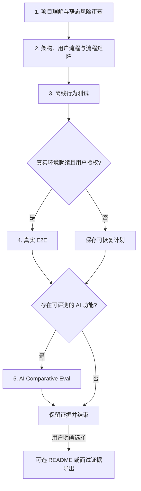

# Project Verifier

> 面向 AI 编程 Agent 的项目理解与可信验证 Skill：帮助用户看懂项目、梳理架构与用户流程、识别风险，并保存可复核的测试和评测证据。

Project Verifier 适用于普通软件、AI-assisted 项目和 AI 产品。它生成证据，不保证项目质量；静态审查、测试结果和 AI Eval 各自只能支持其测量范围内的结论。

## 五阶段流程



Phase 1–3 是通用核心。Phase 4 只有在真实依赖就绪、成本和副作用已说明且用户授权后执行。Phase 5 只适用于存在合理比较主张的 AI / AI-assisted 功能。

### Stage Gate

| 阶段 | Agent 可以直接做 | 用户必须决定 | 缺少条件时 |
|---|---|---|---|
| 1 | 在批准范围内只读分析 | 目标、范围、成功标准 | 标记未检查区域和限制 |
| 2 | 提出路径与图表草案 | P0/P1/P2、图表范围、README 副本 | 保留草案 |
| 3 | 规划离线测试 | oracle、写入文件、CI、依赖 | 记录未知项，不改生产代码 |
| 4 | 无调用 preflight | 真实调用、成本、超时、重试、副作用 | `plan_only`、`blocked` 或 `inconclusive` |
| 5 | 提出 Eval 方向 | 场景、Baseline、指标、样本量、预算 | `not_applicable` 或只保存计划 |

高风险执行绑定计划 SHA-256、当前源码 revision 和执行上限。计划、源码或上限变化后，旧授权失效；没有回复不等于批准。

## 三层验证证据

| 层级 | 适用范围 | 真实依赖 | 能证明什么 |
|---|---|---|---|
| **L1 Offline Behavior** | 几乎所有代码项目 | 不需要 | 当前代码契约、边界和异常处理是否符合已确认 oracle |
| **L2 Live E2E** | 有可运行入口的项目 | 按项目需要 | 当前环境中的批准路径是否真实跑通 |
| **L3 AI Comparative Eval** | 可评测 AI 功能 | 通常需要 | 特定任务、Baseline 和批准指标下的相对结果 |

Project Verifier 遵循 **script-first**：优先复用项目现有测试和确定性脚本。项目已有 Playwright、Cypress 等浏览器 E2E 时，可在 Phase 4 按普通测试脚本执行；Skill 不自动安装浏览器工具。

## 可信度边界

- 不读取、显示或写入真实密钥，只记录环境变量名称。
- 不自动安装依赖，不在未授权时修改生产代码或 CI。
- `preflight` 不执行真实 API、模型、数据库或其他副作用操作。
- 测试失败、流程失败、未执行和证据不足分别记录。
- 保存退出码、耗时、日志、实际调用数、重试和副作用；缺少遥测时标记 `inconclusive`。
- Phase 4 runner 直接观察退出码、耗时和日志路径；外部调用数、重试和副作用通常来自项目脚本自报，除非项目提供独立 instrumentation。
- 测试通过率不等于代码覆盖率。
- 空输出、缺失输出或 runner 失败不能形成胜出结论。
- 单次成功不能证明稳定性；样本不足不计算分位数。
- AI Eval 只报告原始指标、阈值、样本量、证据和限制，不生成通用总分。
- AI Eval 指标只有在用户批准 task-level rubric 后才计算；否则为 `not_measured`。
- LLM Judge 不能单独证明安全、隐私或泄漏风险。
- 静态审查不是渗透测试、合规认证或完整安全保证。
- 在真实 Agent 对照 Eval 完成前，不宣称 Agent 已被证明能稳定遵守所有 Gate。

## 默认产物

用户通常只需要阅读：

```text
project_verification_workbench/
├── project_report.md              # 项目理解、风险、架构图和用户流程
├── flow_matrix.md                 # 人类阅读的路径矩阵
├── phase2_flow_matrix.md          # 后续阶段兼容路径
├── phase3_test_plan.md
├── phase3_test_results.md
├── phase4_usability_plan.md
├── phase4_usability_results.json
├── phase5_benchmark_plan.md
└── phase5_benchmark_results.json
```

机器可信度文件继续保留：

- `verification_manifest.json`
- `authorizations/*.json`
- 原始日志和 runner 输出
- `interview_evidence_source_map.md`（仅在用户选择面试导出后创建）

可选导出：

- `README_updated_[Date]_[RandomID].md`
- `interview_evidence_pack.md`

可选导出必须引用当前 revision 的 workbench 证据，不能凭空生成成果主张。

## 安装与使用

仓库、Skill 路径和调用名是三个不同概念：

```text
repository: https://github.com/Conradgui/project-verifier-skill.git
skill path: skills/project-verifier
invocation: $project-verifier
```

从 GitHub 安装到 Codex：

```bash
python3 /Users/conrad/.codex/skills/.system/skill-installer/scripts/install-skill-from-github.py \
  --url https://github.com/Conradgui/project-verifier-skill/tree/main/skills/project-verifier
```

本地克隆后可先 dry run：

```bash
./bootstrap.sh codex --dry-run
./bootstrap.sh codex
```

调用示例：

```text
使用 $project-verifier 理解并验证当前项目。先确认目标和只读范围；真实调用、依赖安装、生产代码修改和可选导出都必须单独向我确认。
```

## 可选 Codex Hook

`optional/codex-hook/` 提供独立的最小 PreToolUse Hook，用于识别五类高风险动作：生产代码写入、依赖安装、真实联网、破坏性命令和 Git 发布。

Hook 不随 Skill 自动安装，不支持其他宿主，也不构成 sandbox。只有用户单独安装、审查并信任后，它才能为可识别的工具调用增加宿主级阻断；核心 Skill 在没有 Hook 时仍可运行。

## 仓库结构

```text
skills/project-verifier/
├── SKILL.md
├── workflows/                     # 五阶段与可选导出流程
├── templates/                     # Runner、Evaluator、Manifest
├── scripts/validate_gate.py       # revision-bound 授权校验
└── evals/                          # 六类离线行为夹具

optional/codex-hook/                # 单独安装的 Codex Hook
```

## 开发者验证

本仓库区分三种证据：

| 证据 | 当前作用 | 边界 |
|---|---|---|
| 静态 contract tests | 检查文案、产物和禁止行为 | 不能证明 Agent 行为 |
| 本地 fixture tests | 验证 Validator、Runner、Evaluator | 只能证明确定性组件 |
| Agent behavior evals | 新旧 Skill 的真实 Agent 对照 | 仍受模型版本和样本量限制 |

核心离线检查：

```bash
PYTHONPYCACHEPREFIX=/tmp/project-verifier-pycache \
  python3 project_verifier_iteration_workbench/20260626_skill_hardening/template_behavior_tests.py
PYTHONPYCACHEPREFIX=/tmp/project-verifier-pycache \
  python3 project_verifier_iteration_workbench/20260628_conditional_eval_gates/workflow_contract_tests.py
PYTHONPYCACHEPREFIX=/tmp/project-verifier-pycache \
  python3 project_verifier_iteration_workbench/20260629_stage_gate_quality_v2/stage_gate_v2_tests.py
PYTHONPYCACHEPREFIX=/tmp/project-verifier-pycache \
  python3 project_verifier_iteration_workbench/20260630_lean_core_simplification/lean_core_contract_tests.py
```

## License

[MIT License](LICENSE)
