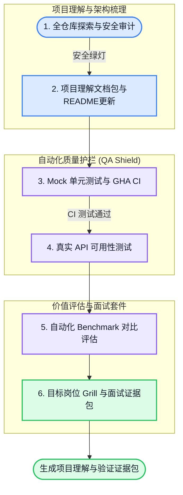

# AI-Agent Project Understanding & Verification Skill

[](https://opensource.org/licenses/MIT)
[](http://makeapullrequest.com)
[](https://github.com/features/copilot)

> **帮助你理解项目结构、梳理架构与用户流程、看清安全/质量风险，并沉淀可复核的验证证据。**

---

## 🌟 核心痛点：为什么你需要它？

在 AI-First 时代，构建一个基于大模型的 App 变得非常简单，但理解、审计和解释一个项目仍然很难：
1. **新接手项目时看不懂结构**：入口、模块关系、外部依赖、用户路径和风险节点散落在代码里。
2. **需要系统化审计却缺少路径**：安全边界、异常处理、状态流转、API 成本风险很容易靠感觉判断。
3. **需要用图表和证据解释项目价值**：仅靠 README 或口头描述，很难让别人快速理解项目是如何工作的、哪里已经验证过、哪里还没有被证明。

**AI-Agent Project Verifier** 是一个面向 AI 项目的理解与验证 workflow skill。它帮助 Agent 读取代码、生成项目理解报告、架构图、用户流程图、流程矩阵、安全/质量审计、测试与 Benchmark 证据。它不是完整 SaaS 平台，也不能替代真实测试和人工判断；它的价值是把“项目如何工作、风险在哪里、哪些结论有证据”固定成可阅读、可复核的文档。

---

## 🧭 6阶段项目理解与验证流



---

## 🛠️ 三层测试框架 (3-Tier Testing Architecture)

本套件采用分层测试思路，但每一层能证明的范围不同：

| 层级 | 测试类型 | 是否使用真实 API | 证明什么 (Proves What) |
| :---: | :--- | :---: | :--- |
| **L1** | **Mock 质量测试** | ❌ 使用 mock/VCR | **代码逻辑与边界行为**。适合低成本验证输入边界、异常传播和本地副作用。 |
| **L2** | **真实可用性测试** | ✅ 使用真实 API | **端到端（E2E）主流程是否跑通**。适合验证真实网络、模型 API 解析和文件写入行为。 |
| **L3** | **自动化 Benchmark 评测** | ✅ 使用真实 API | **特定任务上的相对表现**。只有被 runner JSON、断言、日志或 evaluator 证据覆盖的维度，才能作为优势主张。 |

所有阶段都会把关键证据写入目标项目的 `project_verification_workbench/`，后续阶段必须引用这些产物，而不是只依赖对话上下文。

---

## 📦 它会生成什么？

这个 skill 会生成四类互相独立、但可以互相引用的产物：

| 产物 | 默认位置 | 用途 |
|---|---|---|
| **项目理解文档包** | `project_verification_workbench/project_understanding/` | 面向人阅读，帮助用户理解项目是什么、入口在哪里、模块如何协作、用户如何使用、风险节点在哪里。 |
| **验证 workbench** | `project_verification_workbench/phase*_*.md/json` | 面向后续阶段引用，保存审计、流程矩阵、测试计划、真实可用性结果、Benchmark 结果和面试证据来源。 |
| **README 优化副本** | `README_updated_[Date]_[RandomID].md` | 基于理解结果生成目标项目 README 的改写副本；它不是项目理解文档包本身。 |
| **面试/展示证据包** | `interview_evidence_pack/` | 面向面试、答辩和作品集讲解，基于 workbench 证据和用户 Grill 回答生成岗位化叙事材料。 |

四类产物的关系是：`project_verification_workbench/` 是证据源，`project_understanding/` 是项目理解层，`README_updated_*` 是公开表达层，`interview_evidence_pack/` 是岗位/展示叙事层。面试证据包必须引用 workbench，不能凭空生成成果主张。

项目理解文档包固定包含：

```text
project_verification_workbench/project_understanding/
├── project_understanding_report.md
├── architecture_diagrams.md
├── user_flows.md
└── flow_matrix.md
```

面试/展示证据包固定包含：

```text
interview_evidence_pack/
├── narrative_scripts.md
├── product_decisions.md
├── verification_evidence.md
├── architectural_evolution.md
└── benchmark_radar.html
```

---

## ⚡ 快速开始 (Quick Start)

### 方式 1：把仓库地址发给 Codex 安装（推荐）

在 Codex 中直接发送：

```text
请安装这个 Codex skill 仓库：
https://github.com/Conradgui/project-verifier-skill.git
```

Codex 应识别本仓库内的 skill 路径：

```text
skill path: skills/project-verifier
invoke name: $project-verifier
```

如果 Codex 需要手动安装命令，可以使用：

```bash
python3 /Users/conrad/.codex/skills/.system/skill-installer/scripts/install-skill-from-github.py \
  --url https://github.com/Conradgui/project-verifier-skill/tree/main/skills/project-verifier
```

安装后重启 Codex，让新 skill 被重新发现。

### 方式 2：本地软链接安装

如果你已经克隆本仓库，也可以运行根目录下的 `bootstrap.sh`，将 `skills/project-verifier` 软链接到本机 Agent CLI 的 skill 目录。建议先 dry run 查看计划：

```bash
chmod +x bootstrap.sh

./bootstrap.sh codex --dry-run
./bootstrap.sh codex

# 或链接至已检测到的多个 Agent CLI skill 目录
./bootstrap.sh all --dry-run
./bootstrap.sh all
```

### 方式 3：召唤 Agent 运行验证

部署完成后，在你的 AI 编程终端（如 **Codex** 或 **Claude Code**）中，对目标项目执行：

```text
# 一站式顺序运行 1-6 阶段
使用 $project-verifier 对当前项目运行 phase1-phase6 全流程项目理解、审计、验证与证据生成。

# 选择性运行某一阶段
使用 $project-verifier 对当前项目运行 phase1 只读探索和安全审计。
使用 $project-verifier 的 phase2 为当前项目生成项目理解报告、架构图、用户流程图和流程矩阵。
使用 $project-verifier 的 phase3 为当前项目生成 mock 测试和 GitHub Actions 配置。
```

---

## 📂 技能模块结构

```
.
├── AGENTS.md                  # Codex 仓库级安装识别说明
├── bootstrap.sh               # 本地软链接安装脚本
├── skills/
│     └── project-verifier/
│           ├── SKILL.md       # 技能总控（Main Orchestrator）
│           ├── agents/
│           │     └── openai.yaml # Codex UI 元数据与默认调用提示
│           ├── workflows/     # 每个验证阶段的独立 Workflow 配置文件
│           │     ├── phase1_explore.md  # 阶段 1：只读源码探索与安全审计
│           │     ├── phase2_diagrams.md # 阶段 2：项目理解文档包、Mermaid 图与 README 备份更新
│           │     ├── phase3_quality.md  # 阶段 3：VCR 录制、单元测试与 GitHub Actions
│           │     ├── phase4_usability.md# 阶段 4：真实 API 可用性测试
│           │     ├── phase5_benchmark.md# 阶段 5：LLM-as-a-Judge 与 HTML 看板评测
│           │     └── phase6_interview.md# 阶段 6：目标岗位 Grill 与面试证据包
│           └── templates/     # 评估器与测试运行器模板
│                 ├── benchmark_evaluator_template.py # Radar 图 HTML 生成器
│                 └── run_usability_template.sh       # 独立 E2E 测试脚本
├── CONTRIBUTING.md            # 开源贡献指南
├── LICENSE                    # MIT 开源许可证
└── README.md                  # 本文档
```

---

## ✅ 开发者验证

提交 PR 或修改模板后，建议至少运行以下检查，确保核心模板行为没有回退：

```bash
PYTHONPYCACHEPREFIX=/tmp/project-verifier-pycache \
  python3 project_verifier_iteration_workbench/20260626_skill_hardening/template_behavior_tests.py

bash -n bootstrap.sh
bash -n skills/project-verifier/templates/run_usability_template.sh

PYTHONPYCACHEPREFIX=/tmp/project-verifier-pycache \
  python3 -m py_compile \
    skills/project-verifier/templates/benchmark_evaluator_template.py \
    project_verifier_iteration_workbench/20260626_skill_hardening/template_behavior_tests.py
```

这些检查覆盖两类关键行为：Benchmark evaluator 不会在缺少证据时默认给高分；usability runner 会按 `.py`、`.sh`、`.ts` 脚本类型分发，并在缺少 TypeScript runtime 时给出清晰失败信息。

---

## 📊 成果展现：Benchmark 雷达图看板

在阶段 5 运行结束后，系统除了生成 Markdown 对比报告，还会在项目内输出静态可视化面板 `interview_evidence_pack/benchmark_radar.html`。双击即可在任何浏览器中打开。

### 生成的面试官证据包 (`interview_evidence_pack/`)
在最后一阶段，Agent 可以基于你的目标岗位招聘需求（JD）、Grill 对齐内容和 `project_verification_workbench/` 证据，输出以下派生材料：
*   **`narrative_scripts.md`**：30秒、2分钟、5分钟的自我介绍与项目陈述话术。
*   **`product_decisions.md`**：系统架构的关键技术折衷选择（Trade-offs）与裁剪范围记录。
*   **`verification_evidence.md`**：可复核的自动化测试结果、Benchmark 量化指标，以及尚未被证明的边界。
*   **`architectural_evolution.md`**：项目演进路径、现有技术债与重构路线图。

---

## 🤝 参与贡献 (Contributing)

我们非常欢迎社区提交 Pull Request 或 Issue 来优化该技能模版！请在提交 PR 前查阅 [CONTRIBUTING.md](CONTRIBUTING.md) 以获取开发指南与规范。

---

## 📄 开源许可证

本项目基于 [MIT License](LICENSE) 许可开源。
