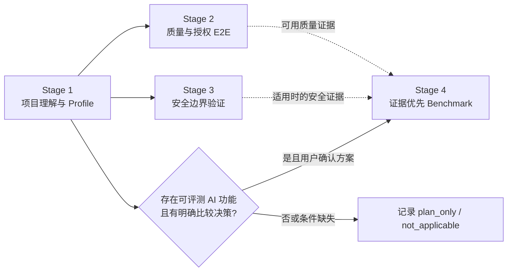

# Project Verifier

> 面向 AI Coding Agent 的项目理解与可信验证 Skill：先看懂项目，再用可复核证据验证质量、安全边界和条件式 AI Benchmark。

它是一个 Skill，不是自动保证质量的平台。所有结论只在其证据范围内成立。

## 四阶段流程



| 阶段 | Agent 负责 | 用户只需决定 | 退出证据 |
|---|---|---|---|
| Stage 1 | 只读遍历、架构/模块/用户流程图、Profile | 目标、P0 路径、事实纠正 | `project_report.md`、`flow_matrix.md`、`project_profile.json` |
| Stage 2 | 离线质量检查、可运行性、授权 Smoke/Live E2E | 选定路径、真实调用与成本 | `quality_report.md`、结果 JSON、日志 |
| Stage 3 | 项目适配的安全工具建议、预检、归一化 | 工具、能力、范围与副作用 | `security_report.md`、受控发现结果 |
| Stage 4 | 从 Profile、已有验证证据和用户方向形成比较方案 | 突出方向、最终方案、Baseline/预算 | `stage4_benchmark_plan.md`；条件生成的结果、报告与收据 |

真实调用、依赖安装、生产代码修改、敏感数据、成本和公开主张都需要当前计划、源码 revision 与授权 envelope 一致；未回复不等于批准。

## 产物

用户默认阅读：

```text
project_verification_workbench/
├── project_report.md
├── flow_matrix.md
├── quality_report.md
├── stage2_quality_results.json
├── security_report.md
├── stage3_security_results.json
├── verification_manifest.json
├── authorizations/
├── stage4_benchmark_plan.md        # 仅 AI Benchmark 适用
├── stage4_benchmark_results.json  # 仅 AI Benchmark 适用
└── benchmark_report.md             # 仅 AI Benchmark 适用；面向人阅读
```

README 优化副本和面试/答辩材料是可选导出，不是验证阶段。它们必须引用当前 workbench，不能凭对话内容生成成果主张。

Stage 4 的必经前置是当前有效的 Stage 1 Profile 与用户确认的比较方案；Stage 2 和 Stage 3 的完成证据会在可用且相关时输入 Benchmark，但不是所有 AI 项目都必须先执行的机械前置。

## 可选面试、答辩与作品集证据包

用户明确提出需要面试、答辩或作品集讲解时，Skill 才会启用这个导出。它不属于默认四阶段，不创建新的原始证据，也不会预先生成简历话术。

导出前，Agent 会先基于当前 revision 的 workbench 和用户的实际贡献，提交一张“候选主张”表供确认；每项主张都包含证据路径、适用范围、限制与不应声称的更强结论。确认后生成：

```text
project_verification_workbench/interview_evidence_source_map.md
interview_evidence_pack.md
```

`interview_evidence_pack.md` 汇总项目叙事、产品/技术决策、已验证结果、限制、可能问题及可追溯回答。没有 Git 历史或其他带日期证据时，它只描述当前架构与后续选项，不会编造“架构演进史”。

## 可信度边界

- script-first：优先复用现有测试和脚本；不自动安装工具。
- 不读取或输出密钥值，只记录环境变量名称。
- `preflight` 不触发模型、API、扫描或目标路径。
- 失败、负面结果、空输出和 `inconclusive` 会被保留。
- 测试通过率不等于覆盖率；单次成功不等于稳定性。
- AI Benchmark 使用项目自定义原始指标、阈值、样本和证据，不使用通用总分或雷达图。
- LLM Judge 只能用于受控质量类别；安全、隐私与泄漏需要其他可复核证据。
- 项目 executor 是显式授权的未隔离 bridge，不是 OS sandbox。
- 静态审查不是安全认证、渗透测试或项目质量保证。

## 安装与调用

```text
repository: https://github.com/Conradgui/project-verifier-skill.git
skill path: skills/project-verifier
invocation: $project-verifier
```

```bash
python3 /Users/conrad/.codex/skills/.system/skill-installer/scripts/install-skill-from-github.py \
  --url https://github.com/Conradgui/project-verifier-skill/tree/main/skills/project-verifier
```

```text
使用 $project-verifier 理解并验证当前项目。先确认目标和只读范围；真实调用、安装、生产代码修改和可选导出都向我确认。需要时，在验证完成后再生成可追溯的面试/答辩证据包。
```

## 开发验证

```bash
PYTHONPYCACHEPREFIX=/tmp/project-verifier-v3-pycache \
  python3 -m unittest discover -s skills/project-verifier/tests -p 'test_*.py' -v
python3 /Users/conrad/.codex/skills/.system/skill-creator/scripts/quick_validate.py skills/project-verifier
./bootstrap.sh codex --dry-run
```

本仓库仅用于个人学习和本地使用；不提供许可证或公开发布承诺。

## 可选 Codex Hook

`optional/codex-hook/` 提供独立的高风险动作提示与阻断辅助。它不随 Skill 自动安装、不替代授权 Gate，也不是 sandbox；安装与边界见 [Hook 说明](optional/codex-hook/README.md)。
