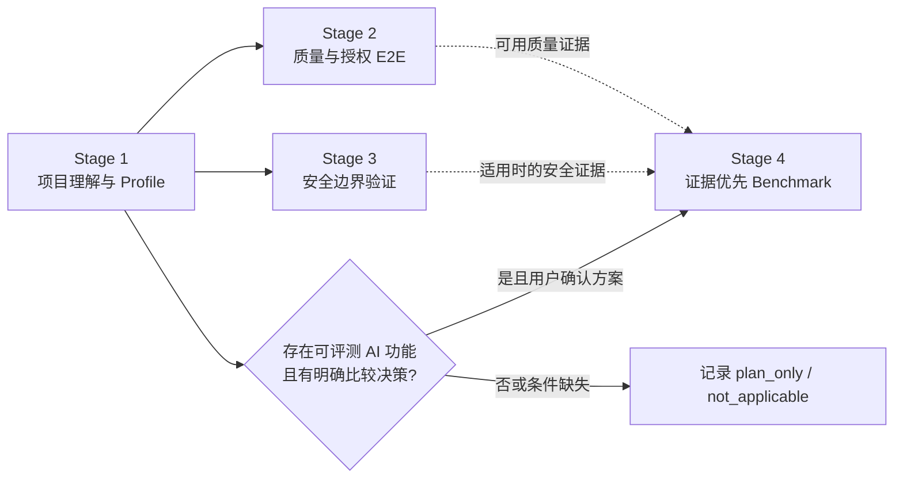

# Project Verifier

> 面向 AI Coding Agent 的项目理解与证据验证 Skill。先看懂项目，再以可复核的工件验证质量、安全边界和条件式 AI Benchmark。

`$project-verifier` 不是“让 Agent 自动给项目打高分”的提示词包，也不是安全认证平台。它把项目理解、验证计划、授权、执行日志和结果说明组织为一条可追溯的工作流，帮助开发者、接手者和面试讲解者回答三个更重要的问题：**项目是什么、已经证明了什么、还没有证明什么。**

## 它解决什么问题

AI Coding 能快速生成代码和测试，但项目交接、质量判断和面试讲解仍常卡在以下断点：

- **看不懂项目**：入口、模块关系、数据流和 P0 用户路径散落在代码、配置和脚本中。
- **验证不成链**：测试、扫描、E2E 和 Benchmark 各自运行，却没有统一的范围、日志、失败原因和证据来源。
- **Benchmark 容易偏题**：AI 项目常在没有明确业务主张、Baseline、样本或预算时就开始“测分”，最后只得到漂亮但不可解释的结论。
- **成果难以防守**：README 或面试材料写得很好，但无法追溯到当前代码版本、测试输出和真实限制。

Project Verifier 的目标不是替你做产品决策，而是让 Agent 在关键决策处停下来，在低风险细节上继续推进，并把每一步的证据保留下来。

## 适合谁

- 刚接手仓库、需要先理解架构和用户流程的开发者或产品负责人。
- 希望用 AI Coding 做质量、安全边界或 AI 功能验证，但不希望 Agent 静默调用 API、安装工具或修改生产代码的人。
- 需要把项目经历讲清楚的求职者：希望展示决策、限制和验证证据，而不是背诵无来源的成果话术。
- 需要把项目验证过程沉淀为可复查 workbench 的个人学习与本地开发场景。

## 它的设计差异

下表不是对其他 Skill 的绝对排名，而是说明本项目刻意选择的工作方式。

| 常见做法 | Project Verifier 的取舍 | 带来的结果 |
| --- | --- | --- |
| 一次性生成项目总结 | 先做只读理解，再将入口、路径和图表绑定源码证据 | 图表和结论可以回到代码核查，未知项不会被填空式脑补 |
| 将测试通过率当成项目质量 | 分开记录离线质量、真实 E2E、执行范围和结果状态 | “未执行、失败、部分完成、证据不足”不会被包装成成功 |
| 先跑 AI Benchmark，再找理由解释 | 先从项目证据和用户方向提出候选主张，再确认 Baseline、样本、指标和预算 | Benchmark 服务于真实项目特点，而不是默认模型对比或通用评分 |
| 直接生成面试话术 | 面试包是可选导出，先确认候选主张，再引用当前 revision 的 workbench | 叙事可以讲清贡献和限制，不把对话内容伪装成验证事实 |

核心优势不在“做更多检查”，而在于把 **理解、授权、执行、证据和主张** 连接起来，同时避免让用户陷入无意义的重复确认。

## 四阶段工作流



| 阶段 | Agent 负责 | 用户只需决定 | 主要产物 |
| --- | --- | --- | --- |
| **Stage 1 项目理解** | 只读遍历、入口与模块梳理、架构/模块/用户流程图、Profile | 目标、P0 路径、事实纠正 | `project_report.md`、`flow_matrix.md`、`project_profile.json` |
| **Stage 2 质量与 E2E** | 离线质量检查、可运行性、授权的 Smoke/Live E2E | 选定路径；真实调用与成本 | `quality_report.md`、`stage2_quality_results.json`、日志 |
| **Stage 3 安全边界** | 项目适配的工具建议、预检、受控发现归一化 | 工具、能力、范围与副作用 | `security_report.md`、`stage3_security_results.json` |
| **Stage 4 AI Benchmark** | 从 Profile、已有验证证据和用户方向形成比较方案 | 突出方向、最终方案、Baseline 与预算 | `stage4_benchmark_plan.md`；适用时生成结果、报告与收据 |

Stage 1 是后续阶段的共同前置。Stage 2、Stage 3 与 Stage 4 只在当前 Profile 有效时执行；Stage 4 不要求机械地先完成 Stage 2/3，但会在已有证据相关时使用它们。

## 你会得到什么

### 1. 项目理解与验证 workbench

```text
project_verification_workbench/
├── project_report.md
├── flow_matrix.md
├── project_profile.json
├── verification_manifest.json
├── authorizations/
├── quality_report.md                 # Stage 2 适用时
├── stage2_quality_results.json       # Stage 2 适用时
├── security_report.md                # Stage 3 适用时
├── stage3_security_results.json      # Stage 3 适用时
├── stage4_benchmark_plan.md          # Stage 4 适用时
├── stage4_benchmark_results.json     # Stage 4 适用时
└── benchmark_report.md               # Stage 4 适用时，面向人阅读
```

其中 `verification_manifest.json` 与授权收据记录阶段状态、源码版本、执行范围、限制和恢复条件。它不是防篡改系统，但能把“谁在什么范围内、基于哪个版本、执行了什么”保留下来。

### 2. 可选 README 优化副本

基于项目理解结果生成 `README_updated_[Date]_[RandomID].md`，用于改写目标项目的公开说明。它不会替代 workbench，也不会改写原 README，除非用户另行确认。

### 3. 可选面试、答辩与作品集证据包

仅当用户明确提出需要面试、答辩或作品集讲解时才启用。它不是默认第五阶段，不创建新的原始证据，也不会预先生成简历话术。

导出前，Agent 会基于当前 revision 的 workbench 和用户实际贡献，提交“候选主张”表供确认。每项主张都要包含证据路径、适用范围、限制和不应声称的更强结论。确认后生成：

```text
project_verification_workbench/interview_evidence_source_map.md
interview_evidence_pack.md
```

证据包可汇总项目叙事、产品/技术决策、已验证结果、限制、可能问题及可追溯回答。没有 Git 历史或其他带日期证据时，只描述当前架构与后续选项，不编造“架构演进史”。

## 可信度与安全边界

- **脚本优先**：优先复用项目已有测试、构建、lint 与 E2E；不自动安装工具。
- **授权失效即停止**：计划、源码 revision、授权 envelope 或执行上限不一致时拒绝执行；未回复不等于批准。
- **预检不产生副作用**：`preflight` 不执行目标路径、模型、API、扫描或生产代码修改。
- **结果如实保留**：失败、负面结果、空输出、缺少遥测和 `inconclusive` 都是有效结论，不能转化为正向主张。
- **Benchmark 不伪精确**：使用项目自定义原始指标、阈值、样本量和证据；不提供通用总分或默认雷达图。
- **安全结论有范围**：LLM Judge 不能单独证明安全、隐私或泄漏；静态审查不是渗透测试、合规认证或“没有漏洞”的证明。
- **受信任 executor 不等于 sandbox**：项目 executor 必须显式授权，但它是未隔离 bridge，不是操作系统级隔离。

## 快速开始

```text
repository: https://github.com/Conradgui/project-verifier-skill.git
skill path: skills/project-verifier
invocation: $project-verifier
```

```bash
python3 /Users/conrad/.codex/skills/.system/skill-installer/scripts/install-skill-from-github.py \
  --url https://github.com/Conradgui/project-verifier-skill/tree/main/skills/project-verifier
```

```text
使用 $project-verifier 理解并验证当前项目。先确认目标和只读范围；
真实调用、安装、生产代码修改和可选导出都向我确认。需要时，在验证完成后再生成可追溯的面试/答辩证据包。
```

## 开发验证

```bash
PYTHONPYCACHEPREFIX=/tmp/project-verifier-pycache \
  python3 -m unittest discover -s skills/project-verifier/tests -p 'test_*.py' -v
python3 /Users/conrad/.codex/skills/.system/skill-creator/scripts/quick_validate.py skills/project-verifier
./bootstrap.sh codex --dry-run
```

`optional/codex-hook/` 还提供独立的高风险动作提示与阻断辅助。它不随 Skill 自动安装、不替代授权 Gate，也不是 sandbox；安装与边界见 [Hook 说明](optional/codex-hook/README.md)。

## 范围说明

本仓库用于个人学习与本地使用。它的价值是让项目验证与项目讲解更可解释，而不是替代工程判断、真实用户测试、安全专家或发布流程。
