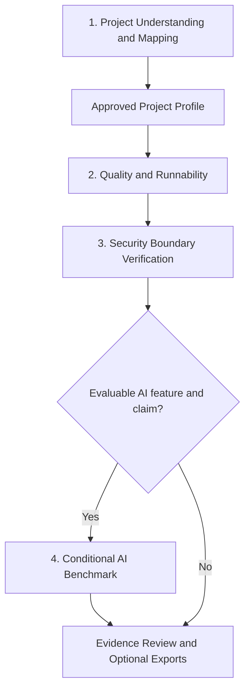

# Project Verifier Four-Stage Adapter V3 Design

Date: 2026-07-10

Status: Written specification and orchestration addendum approved; implementation plan ready

## 1. Context

The current release-closeout branch has a strong credibility control plane, but its five-stage structure does not match the user's final mental model:

- project understanding and diagrams are split across two phases;
- offline quality tests and live E2E appear repetitive to a user;
- security review exists only as scattered static checks rather than a dedicated verification stage;
- Benchmark planning is evidence-aware, but concrete project adaptation still depends on an ad hoc executor;
- authorization is bound too closely to complete plan files, so harmless edits can trigger unnecessary reapproval;
- the repository version and the locally installed Skill are currently different.

V3 restructures the Skill around four user-facing stages and adds a project adaptation layer. The Skill remains a workflow Skill, not a platform or general-purpose security product.

## 2. Goals

1. Give the user one stable four-stage mental model.
2. Generate project understanding documents, architecture diagrams, module/data flows, and user flows from source evidence.
3. Combine code quality, offline behavior verification, runnability, and authorized live E2E into one stage.
4. Add a dedicated security-boundary verification stage with project-fit tool selection and normalized findings.
5. Make AI Benchmark an evidence-backed way to test the characteristics the user wants to highlight.
6. Adapt mature external tools to the current project instead of merely recommending a download command.
7. Keep the user in control of consequential product and risk decisions without asking them to manage technical details.
8. Preserve negative, failed, partial, stale, and inconclusive evidence without turning it into positive claims.

## 3. Non-Goals

- Do not build a SaaS platform, plugin marketplace, or multi-host orchestration system.
- Do not auto-install global dependencies.
- Do not promise complete source review, penetration testing, compliance certification, or vulnerability absence.
- Do not force every project to use every supported security or evaluation framework.
- Do not generate universal project scores, universal security scores, or default radar charts.
- Do not make interview, portfolio, defense, or README exports part of the verification stages.
- Do not add license-management workflows. The repository `LICENSE` file and README License section will be removed during implementation as explicitly requested.

## 4. Design Principles

### 4.1 Evidence first

Every project fact, finding, metric, and public claim must cite current-revision evidence or be marked `inferred`, `unknown`, `not_measured`, or `inconclusive`.

### 4.2 Quality first, not existing-tool first

Existing tools are reused only when they fit the project and verification objective. If a better tool exists, the Agent recommends it with trade-offs. If the user declines, the Agent falls back explicitly and records the coverage loss. Silent downgrade is prohibited.

### 4.3 Script first

Reuse deterministic project scripts and existing tests before generating new code. Generate a minimal project bridge only when a tool cannot consume the project's real interface.

### 4.4 Decision-envelope authorization

Hash and approve only risk- and interpretation-relevant fields. Formatting, file organization, logging details, harmless command ordering, and other reversible technical details do not invalidate approval.

### 4.5 Small user decision surface

The user controls goals, critical paths, risk/cost limits, sensitive-data use, Benchmark direction, Baseline meaning, and claim approval. The Agent owns reversible technical details inside those boundaries.

### 4.6 Portable orchestration

Prefer fresh subagents when the host provides them, but keep the execution contract independent of one host or framework. The same task briefs, evidence, reviews, and recovery ledger must work in an inline fallback. Never hide the loss of independent review.

## 5. Four-Stage Architecture



The control plane spans all four stages. It is not a fifth stage.

| Stage | Question answered | Default user decision |
|---|---|---|
| 1. Understanding and Mapping | What is this project and how does it work? | Goal, P0 paths, factual corrections |
| 2. Quality and Runnability | Is the code healthy and do approved paths run? | Production changes, dependencies, live calls |
| 3. Security Boundary Verification | Where can the project be exploited, misconfigured, or leak data? | Tool acquisition, network/dynamic/active scope |
| 4. Conditional AI Benchmark | Are selected AI characteristics supported by comparison evidence? | Direction, Baseline, metric meaning, budget, final plan |

Routine operation should normally require one summarized confirmation per stage. Additional prompts occur only when a new material risk or interpretation change appears.

## 6. Control Plane

### 6.1 Canonical state

Keep separate state dimensions:

- `phase_status`: `pending / in_progress / completed / blocked / skipped / not_applicable / failed`
- `result_outcome`: `not_run / pass / fail / partial / inconclusive`
- `execution_scope`: `none / plan_only / pilot / full`
- `claim_eligibility`: `none / pilot / full`

A completed test stage may have `result_outcome: fail`. A runner crash is not the same as a product-path failure.

### 6.2 Decision envelope

Each consequential stage approval stores a compact machine-readable envelope. It includes only fields that affect risk or result interpretation, such as:

- selected paths and targets;
- allowed write scope and side effects;
- dependency, network, credential-name, and sensitive-data permissions;
- maximum cost, calls, retries, and timeout;
- security scan mode and target;
- Benchmark claim, Baseline class, dataset scope, metric meaning, and sample requirement.

The envelope is hashed and recorded with a decision ID and source identity.

### 6.3 Material changes

Renew approval only when a change:

- adds installation, network, sensitive-data, destructive, or external-side-effect access;
- exceeds approved cost or execution limits;
- changes a P0 path, security target/mode, Benchmark claim, Baseline, core dataset scope, or metric meaning;
- writes outside the approved scope;
- changes the product semantics of the verified feature.

Do not renew approval for report wording, log names, file layout, command ordering, parser fixes, lower limits, or other technical details inside the approved envelope.

Approved source fixes do not require the user to approve the same test objective again. Record a new source snapshot, mark old results `stale`, and rerun the approved verification when the changed paths remain inside the envelope.

## 7. Project Profile and Stage Plans

### 7.1 Stable project facts

`project_profile.json` stores only relatively stable project facts:

- source identity and reviewed scope;
- languages, runtimes, package managers, and deployment model;
- user entry points and P0/P1/P2 paths;
- core modules, data flows, external services, and state changes;
- sensitive data and trust boundaries;
- AI/non-AI classification at feature level;
- existing build, lint, test, E2E, scan, and Benchmark capabilities;
- evidence references, confirmed facts, inferred facts, and unknowns.

The Agent generates the Profile draft after Stage 1. The user reviews only interpretation-changing fields. Approved fields are bound to the current source snapshot.

### 7.2 Stage-specific actions

Do not put commands and transient tool choices into the Profile. Create separate plans:

- `phase2_quality_plan.json`
- `phase3_security_plan.json`
- `phase4_benchmark_plan.json`

Each stage plan records selected paths, tool choice, alternatives, user decisions, exact commands, version, limits, expected artifacts, stop conditions, and coverage limitations.

The user reviews a concise Markdown summary rather than editing JSON.

## 8. Adapter Layer

### 8.1 Purpose

The adaptation layer translates project evidence into correct tool inputs and translates tool outputs back into project evidence. It prevents the Skill from becoming a list of generic installation commands.

### 8.2 Lifecycle

All adapters follow:

```text
detect -> propose -> preflight -> run -> normalize
```

- `detect`: inspect existing project/tool capability without target execution;
- `propose`: compare project-fit options and recommend a primary and fallback path;
- `preflight`: validate commands, versions, inputs, schemas, limits, and permissions without real scan/model execution;
- `run`: execute only inside the approved decision envelope;
- `normalize`: retain raw output and produce the Skill's canonical result schema.

### 8.3 Minimal bridge policy

Generate a project-specific bridge only when an existing project command or tool adapter cannot provide the required input/output contract. Store bridges in the workbench, not production source, unless a separately approved source change is necessary.

### 8.4 Tool acquisition

1. Detect existing project and system capabilities.
2. Evaluate fitness against language coverage, analysis depth, output quality, offline ability, maintenance, installation cost, and known limitations.
3. Recommend the best-fit option even when it is not currently installed.
4. If the user declines, use the approved fallback and disclose reduced coverage.
5. Prefer pinned project-local, temporary, or existing Docker execution after approval.
6. Do not auto-install globally or use an unpinned `latest` command.
7. Treat download, vulnerability-database update, target network access, and model calls as separate permissions.

Tool examples are optional backends, not mandatory dependencies:

- security: Trivy, OSV-Scanner, Semgrep, Gitleaks, ZAP, or project-native tools;
- AI evaluation: Promptfoo, DeepEval, Ragas, Inspect, or the built-in lightweight evaluator.

## 9. Execution Orchestration

### 9.1 Backend selection

Detect orchestration capability before implementation begins:

- `subagent_serial`: preferred when fresh implementer and reviewer agents are available;
- `inline_serial`: fallback when subagent capability is absent, dispatch fails, or safe file ownership cannot be delegated.

A non-material backend switch does not require repeated user approval. Record the backend, reason, and transition. When no independent reviewer exists, record `review_independence: self_review_only`; do not present self-review as independent review.

### 9.2 Serial-first scheduling

Implementation tasks run serially by default. Parallel dispatch is allowed only when tasks have no dependency edge, disjoint write sets, no shared schema/manifest/test-entrypoint ownership, isolated workspaces or read-only scope, a defined integration owner/order, and no behavior-changing failure dependency. Unknown independence means serial execution.

The current V3 plan uses this safe serial order. Some edges exist to prevent shared-file integration conflicts rather than because of a functional data dependency:

```text
Task 1 -> Task 2 -> Task 3 -> Task 4 -> Task 5 -> Task 6 -> Task 7 -> Task 8
```

### 9.3 Controller-mediated roles

The controller owns the approved plan, dependency graph, user communication, integration, and material decisions. Each task uses a fresh implementer, then a fresh reviewer with separate specification-compliance and code-quality verdicts. Critical or important findings go through fix and re-review before the next task.

Subagents do not use free-form peer conversation as shared state. The controller passes only the task brief, binding global constraints, consumed interfaces, source identity, and artifact paths needed for that task.

### 9.4 Durable handoff artifacts

Use:

```text
project_verification_workbench/agent_execution/
├── execution_manifest.json
├── progress.md
├── task-N-brief.md
├── task-N-report.md
├── task-N-review.md
└── review-packages/
```

Implementer status is `DONE / DONE_WITH_CONCERNS / NEEDS_CONTEXT / BLOCKED`. Reports record before/after source identity, files changed, interfaces, exact test commands and exits, self-review, concerns, and evidence paths. Reviews record `spec_compliance` and `code_quality` as `approved / changes_required / cannot_verify`, with file/line evidence.

Git state, diffs, test output, and workbench artifacts have higher authority than agent summaries. The progress ledger is the resume source after compaction, dispatch failure, or backend switching; completed tasks are not re-dispatched.

### 9.5 Framework boundary

Borrow orchestration patterns from mature projects, but do not add AutoGen, LangGraph, MetaGPT, OpenAI Agents SDK, or another multi-agent runtime dependency. Project Verifier remains a portable Skill workflow.

## 10. Stage 1: Project Understanding and Mapping

### 10.1 Scope

Perform repository-wide inventory plus risk-based deep reading. Do not claim complete line-by-line understanding for large repositories.

### 10.2 Outputs

- `project_report.md`
- `flow_matrix.md`
- `project_profile.json`

`project_report.md` includes project purpose, reviewed scope, coverage ledger, entry points, architecture, module/data flows, user flows, failure recovery, trust boundaries, risks, and limitations. Mermaid source is embedded in the report.

### 10.3 Gate

The user confirms the project goal, P0 paths, major factual corrections, and interpretation-changing Profile fields. The Agent resolves technical details and document organization autonomously.

## 11. Stage 2: Quality and Runnability

### 11.1 Scope

Combine the current offline behavior and live usability concepts:

- static quality review, including unreachable paths, loop termination risk, error swallowing, resource cleanup, state consistency, and unsafe side effects;
- existing lint, build, unit, integration, and E2E commands;
- generated offline tests for approved gaps;
- local start and Smoke verification;
- authorized live E2E when real dependencies are required.

### 11.2 Boundaries

- Do not modify production code merely to make a test pass without an approved fix envelope.
- Block network in offline tests.
- Do not install dependencies automatically.
- Treat local and external paths separately.
- Preserve command, exit code, duration, logs, path results, side effects, and telemetry provenance.

### 11.3 Outputs

- `quality_report.md`
- `phase2_quality_plan.json`
- `phase2_quality_results.json`
- raw logs and generated tests/runners

## 12. Stage 3: Security Boundary Verification

### 12.1 Applicability matrix

Select relevant surfaces from the Profile:

- source vulnerability patterns and manual data-flow review;
- dependency, lockfile, SBOM, and known-vulnerability analysis;
- secrets in current files, history, outputs, and logs;
- Docker, IaC, permissions, CORS, headers, and deployment configuration;
- passive Web/API inspection;
- separately authorized active scanning;
- AI-specific prompt injection, tool authorization, leakage, and unsafe external-action risks.

### 12.2 Authorization

An approved plan may batch-run installed, offline, read-only scans. Tool installation, download, database update, network access, target access, passive dynamic scanning, and active scanning require separate hard authorization. Active scanning is limited to a user-confirmed local or isolated test target.

### 12.3 Finding contract

Normalize findings to:

- `finding_id`
- `category`
- `severity`
- `confidence`
- `triage_status`
- `source_location`
- `affected_user_path`
- `evidence`
- `exploit_preconditions`
- `tool_and_version`
- `recommended_action`
- `verification_method`
- `limitations`

Use `confirmed / likely / needs_review / false_positive / accepted_risk` for triage. Deduplicate overlapping tool findings and link them to project modules, trust boundaries, and user paths. Redact secret values.

Do not generate a universal security score. A clean scan means only that no issue was found in the executed scope.

### 12.4 Outputs

- `security_report.md`
- `phase3_security_plan.json`
- `phase3_security_results.json`
- raw scanner output and execution logs

## 13. Stage 4: Conditional AI Benchmark

### 13.1 Applicability

Run only for an AI or AI-assisted feature with a meaningful, falsifiable comparison claim.

### 13.2 Two controlled inputs

Benchmark direction comes from:

1. evidence-derived characteristics from architecture, flows, tests, failures, and product behavior;
2. the user's desired highlight direction.

The Agent proposes 3-5 evidence-grounded characteristics. The user may select, combine, reject, or provide another direction.

User intent is a hypothesis, not a guaranteed result. Unsupported, unfair, negative, and inconclusive outcomes must remain visible.

### 13.3 Dataset contract

Use real project evidence first: existing tests, user flows, real inputs, logs, past failures, and confirmed business rules. The Agent may propose edge, adversarial, and long-tail cases.

Label each sample `real / existing_test / user_confirmed / synthetic_candidate`. A synthetic candidate cannot become ground truth without a deterministic oracle or user confirmation.

Use Smoke, development, and Holdout splits only when the available sample size justifies them. Version and hash the approved dataset.

### 13.4 Backend routing

- general LLM/agent evaluation: Promptfoo may be recommended;
- Python/pytest-oriented evaluation: DeepEval may be recommended;
- RAG-specific evaluation: Ragas may be recommended;
- high-control Task/Solver/Scorer or sandboxed evaluation: Inspect may be recommended;
- unavailable, rejected, or unsuitable framework: use the built-in lightweight adapter and disclose coverage loss.

External frameworks are replaceable execution backends. The Project Verifier evidence contract is canonical.

### 13.5 Metric and execution rules

- deterministic assertions first;
- domain/business metrics second;
- blinded, versioned LLM Judge only for subjective semantic criteria;
- no Judge-only safety, security, privacy, or leakage conclusion;
- Tool and Baseline use equivalent inputs, resources, versions, sampling settings, and failure policy, or disclose deviations;
- preflight makes no model/tool/target call;
- Pilot proves harness feasibility only;
- minimum samples apply before stability or percentile claims;
- the full plan is reviewed before execution.

### 13.6 Claim matrix

The final report maps:

- project characteristic;
- falsifiable claim;
- user value and path;
- Baseline;
- dataset provenance and sample count;
- Tool and Baseline raw values;
- threshold result;
- `supported / partially_supported / not_supported / inconclusive`;
- evidence and failure cases;
- limitations and excluded stronger claims.

Do not collapse different metrics into a universal score or radar chart.

### 13.7 Outputs

- `benchmark_report.md`
- `phase4_benchmark_plan.json`
- `phase4_benchmark_results.json`
- versioned dataset, raw backend output, adapters, and logs

## 14. User-Facing Artifacts

The default reading path is intentionally small:

```text
project_report.md
flow_matrix.md
quality_report.md
security_report.md
benchmark_report.md  # only when applicable and executed
```

Machine evidence remains under `project_verification_workbench/`:

```text
verification_manifest.json
project_profile.json
authorizations/
phase*_plan.json
phase*_results.json
adapters/
raw/
```

Optional exports are not stages:

- `README_updated_[Date]_[RandomID].md`
- `interview_evidence_pack.md`

Both must cite current workbench evidence and require claim approval.

## 15. Failure, Staleness, and Recovery

- A verification failure is preserved as an observed result.
- Missing prerequisites produce `blocked` or `plan_only` with recovery conditions.
- Runner/infrastructure failure is distinct from product-path failure.
- Missing telemetry or insufficient evidence produces `inconclusive`.
- Source changes mark affected results `stale`; old evidence remains available.
- Changes inside an approved fix envelope may refresh the source snapshot and rerun without asking the user to approve the same objective again.
- Material scope, risk, cost, target, Baseline, dataset, metric, or claim changes require renewed approval.

## 16. Documentation and Repository Scope

Implementation must update README, SKILL.md, workflows, templates, agent metadata, fixture descriptions, and tests together.

README must explain:

- the final four-stage flow;
- what the user decides and what the Agent decides;
- the project Profile and mixed adapter layer;
- quality-first tool recommendations and explicit fallback;
- conditional security and Benchmark backends;
- credibility boundaries and what results cannot prove.

Remove the repository `LICENSE` file and README License section. Do not add license-management features or public-release marketing work.

Keep the Skill name, repository path, invocation name, and current iteration branch unchanged. Do not merge to `main`, push, or update the locally installed Skill during implementation without separate authorization.

## 17. Migration from the Current Branch

1. Keep current V2 canonical validators, runners, templates, and CI consumers unchanged while Tasks 1-6 build V3 files beside them.
2. End every task with the complete currently active V3 suite and historical V2 CI commands passing.
3. Replace the five-phase user contract with four stages.
4. Merge current Phase 1 and Phase 2 behavior into Stage 1.
5. Merge current Phase 3 and Phase 4 behavior into Stage 2.
6. Add the dedicated Stage 3 security workflow and normalized finding contract.
7. Renumber and rebuild the AI Benchmark as Stage 4 with dual-input direction selection and backend adapters.
8. Replace full-plan authorization hashes with decision-envelope hashes while preserving fail-closed behavior for material changes.
9. In Task 7, promote tested V3 files to canonical names, switch CI, and remove obsolete V2 consumers atomically only after the complete V3 suite and migration matrix are GREEN.
10. Keep the optional single-file interview and README exports.

Backward compatibility with the old Phase numbering is not a product goal for this private final iteration. The implementation should prefer one clear source of truth over duplicated compatibility files.

## 18. Verification Strategy

Reuse existing deterministic tests where still valid and add focused coverage for:

- four-stage contracts and optional exports;
- Profile facts versus stage plans;
- material versus non-material authorization changes;
- approved source fixes and stale-result reruns;
- quality-first tool selection, explicit rejection, and disclosed fallback;
- adapter detect/propose/preflight/run/normalize boundaries;
- preflight with no target/model execution;
- security result normalization, deduplication, redaction, triage, and path linkage;
- Benchmark dual inputs and user plan review;
- real versus synthetic dataset provenance;
- backend routing using fake outputs and no real API calls;
- negative, partial, unsupported, and inconclusive Benchmark results;
- no universal security score, project score, or radar chart;
- missing tools, credentials, telemetry, outputs, and evidence;
- README, SKILL, workflow, template, metadata, and actual behavior consistency.
- subagent capability detection, serial scheduling, inline fallback, structured handoffs, review independence, and resume behavior.
- machine-checked one-to-one coverage from every historical executable test to a real V3 test. The V3 migration uses an empty retirement allowlist; no historical authorization, runner, evaluator, telemetry, negative-result, evidence-integrity, or mixed-contract test may be retired.

Adapt the existing six local fixtures to the four-stage contract. Model-backed Agent forward testing remains separately authorized after showing model, run count, token estimate, and budget.

## 19. Acceptance Criteria

The V3 implementation is acceptable only when:

1. README and Skill expose exactly four stages plus optional exports.
2. Stage 2 owns both offline quality verification and authorized real E2E.
3. Stage 3 has a real security plan/result contract and project-fit adapter routing.
4. Stage 4 has dual-input direction selection, an approved dataset/claim contract, and replaceable backends.
5. The user is not asked to approve reversible technical details.
6. Non-material changes do not invalidate authorization; material changes fail closed.
7. Missing evidence, empty output, runner failure, negative results, and stale results cannot become positive claims.
8. External tools are never silently installed or silently substituted.
9. No real API, active security target, global installation, Git publication, or local Skill overwrite occurs without separate authorization.
10. Deterministic tests and static validation pass, and any unexecuted Agent behavior evaluation is explicitly disclosed.
11. Subagent execution is preferred when available, with the same task contract executable inline when unavailable.
12. Implementation tasks are serial unless the explicit parallel-safety conditions all pass.
13. Every delegated task has a durable brief, report, review, and progress-ledger entry; agent prose never replaces Git or test evidence.
14. Inline fallback discloses when independent review was unavailable and never re-dispatches completed work.
