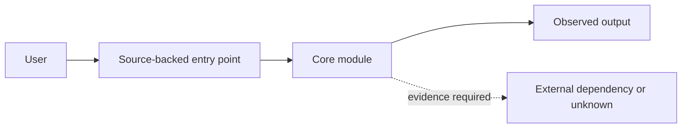
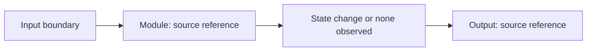
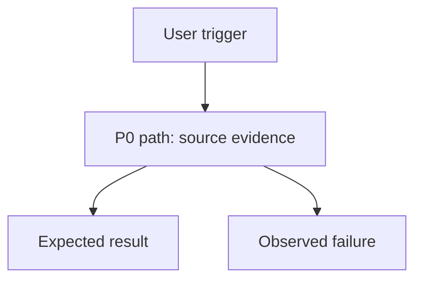
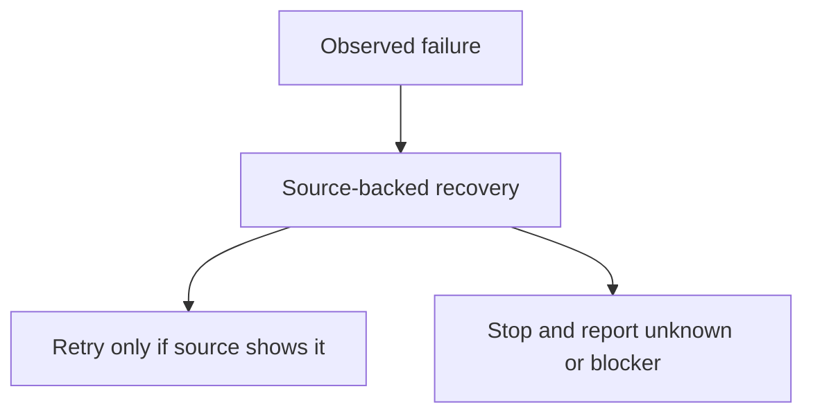

# Stage 1: Project Understanding and Profile Gate

## Purpose

Create a source-backed understanding package for the approved repository scope.
This is static understanding and scope control. It is not an exhaustive code
review, penetration test, compliance certification, or proof of complete
repository coverage.

## Safety Boundary

- Do not read secret values. Record only environment-variable names when they
  are visible in source, example configuration, or documentation.
- Do not install dependencies or execute project programs.
- Do not access networks or make live calls.
- Do not write production source, tests, CI configuration, or README files.
- Write only the Stage 1 workbench artifacts under
  `project_verification_workbench/`.
- Treat unreadable, generated, vendor, binary, credential-bearing, and
  explicitly excluded content as exclusions or unknowns, not as reviewed code.

## Inputs and Output Boundary

Use the user's stated goal, success criteria, scope, exclusions, and risk
tolerance as inputs. Do not add a separate early approval gate: absent input is
recorded as an unknown for the single confirmation later in this workflow.

Produce these Stage 1 artifacts:

- `project_verification_workbench/project_report.md`
- `project_verification_workbench/flow_matrix.md`
- `project_verification_workbench/project_profile.json`

README rewriting is a separate optional output. Do not create a README copy
unless the user separately requests it after Stage 1.

## Procedure

1. Capture the current source revision with the approved secret-safe
   fingerprint mechanism. Initialize or update the Stage 1 manifest state as
   `in_progress`; record the source revision, user-provided scope, and the
   workbench write boundary.
2. Build a repository-wide inventory of tracked and relevant untracked source,
   configuration, tests, scripts, documentation, and dependency manifests.
   Record counts and candidate exclusions. For repositories with more than 80
   files, publish the reading plan before deep reading: entry points, shared
   state, side effects, trust boundaries, high-risk dependencies, and tests
   receive risk-based deep reading. Sampled directories remain explicitly
   labeled. The report must not claim line-by-line-complete coverage.
3. Maintain a coverage ledger with reviewed files, excluded directories,
   unreviewed areas, and coverage limitations. Each unreviewed area has a
   reason, such as user exclusion, generated content, binary content, size
   limit, missing runtime context, or insufficient source evidence.
4. Trace source-backed entry points through modules, inputs, outputs, state
   changes, external dependencies, trust boundaries, user-visible failures,
   and recovery paths. Classify every relevant feature as `AI`,
   `AI-assisted`, `non-AI`, or `unknown`; feature-level AI classification must
   cite source evidence. Do not classify an entire mixed product from one
   feature.
5. Draft the three artifacts below. A source reference is a repository-relative
   path plus symbol or line range. Every P0, P1, and P2 path must include source evidence.
   If a path cannot be traced, omit it from the matrix and place the missing
   relationship in `unknowns`; do not manufacture a source reference.
6. Present exactly one concise user confirmation after the drafts are ready.
   It asks for the goal, P0 paths, factual corrections, and
   interpretation-changing unknowns. It also shows exclusions and coverage
   limitations when they materially affect the interpretation. The user does
   not approve document wording, reading order, or other technical details.
7. Apply confirmed factual corrections, retain declined or unresolved items as
   unknowns, hash the approved Profile fields as `approved_fields_sha256`, bind
   that hash to the current source revision, and mark Stage 1 complete. A source
   or approved-field change makes the Profile draft stale until reviewed again.

## Completion And Handoff Contract

On completion, update the manifest in the same source snapshot:

- `stage1.artifacts` lists `project_report.md`, `flow_matrix.md`, and
  `project_profile.json` under `project_verification_workbench/`.
- `stage1.phase_status` is `completed`; the remaining state dimensions state
  only the evidence actually gathered.
- `project_profile.status` is `confirmed` and its
  `approved_fields_sha256` equals the hash stored with the finalized Profile.
- `project_profile.source_identity.revision` equals the manifest source revision
  used for the confirmation.

Stage 2, Stage 3, and Stage 4 must refuse to consume the Profile when
`stage1.phase_status` is not `completed`, `project_profile.status` is not
`confirmed`, `approved_fields_sha256` is missing, or the Profile source revision
does not equal the current manifest source revision. Mark the dependent stage
`blocked` or `not_applicable` with a recovery condition; do not infer missing
Stage 1 facts from a stale draft.

## `project_report.md` Draft

Write a human-readable report containing:

- purpose, current source identity, requested scope, exclusions, and success
  criteria;
- project summary, reviewed files, excluded directories, unreviewed areas, and
  coverage limitations;
- source-backed entry points, modules, data/state flow, external dependencies,
  environment-variable names, sensitive-data categories, and trust boundaries;
- feature-level AI classification with a source reference per feature;
- candidate P0/P1/P2 paths, risks, failures, recovery behavior, and unknowns;
- an explicit statement that the report is static understanding, not a
  line-by-line-complete review or a security/compliance conclusion.

Embed Mermaid source in the report. These diagrams are source-backed drafts;
use `unknown` nodes or annotations where evidence does not establish a link.
Immediately after each diagram, include a **Mermaid evidence legend** with the
node or edge identifier, source reference, and epistemic status. Every non-`unknown` relationship
must cite a source reference in that legend. An
inferred relationship must be marked `inference` with its rationale; an
unproven relationship must remain `unknown` rather than appearing as a factual
edge.

### Architecture



### Module/data flow



### User flow



### Failure recovery



## `flow_matrix.md` Draft

Use one row for each proposed P0/P1/P2 path. Do not give a path a priority or
expected result without a source reference. `Unknown` is a valid value when the
source does not establish an item.

| Path ID | Priority | User goal | Source evidence | Entry point | Preconditions | Expected result | Failure recovery | Coverage note |
|---|---|---|---|---|---|---|---|---|
| `P0-example` | `P0` | Source-backed user goal | `path/to/file.py:10-20` | `symbol` | Observed or `unknown` | Observed or `unknown` | Observed or `unknown` | Reviewed / sampled / unknown |

## `project_profile.json` Draft

Use the V3 Profile structure for stable facts only. Keep commands, tool choices,
transient logs, and speculative risk ratings out of the Profile.

Separate epistemic layers as follows:

- **facts:** populate stable fields such as `source_identity`, `reviewed_scope`,
  `runtimes`, `entry_points`, `priority_paths`, `modules`, `state_changes`,
  `trust_boundaries`, `feature_ai_classification`, and
  `existing_capabilities`; link each to `evidence_references`.
- **inferences:** use the `inferences` array only for reasoned interpretations
  that are not directly stated by source; include the supporting evidence and
  rationale.
- **unknowns:** use the `unknowns` array for absent, excluded, ambiguous, or
  runtime-dependent facts; include why the evidence is insufficient and whether
  the unknown changes interpretation.

Never promote an inference or unknown to a fact merely to complete a diagram,
matrix row, or classification.

## Single Confirmation Format

Present only this decision summary before formalizing the artifacts:

```text
Stage 1 confirmation
Goal: <current understanding or unknown>
P0 paths: <IDs and source references>
Factual corrections requested: <prompt for corrections>
Interpretation-changing unknowns: <items and impact>
Coverage limits that affect the above: <items>
Decision: confirm / correct facts / revise P0 paths / stop
```

Silence is not confirmation. Keep unconfirmed interpretation-changing Profile
fields as `unknown`, do not compute `approved_fields_sha256`, and do not mark
Stage 1 complete.
